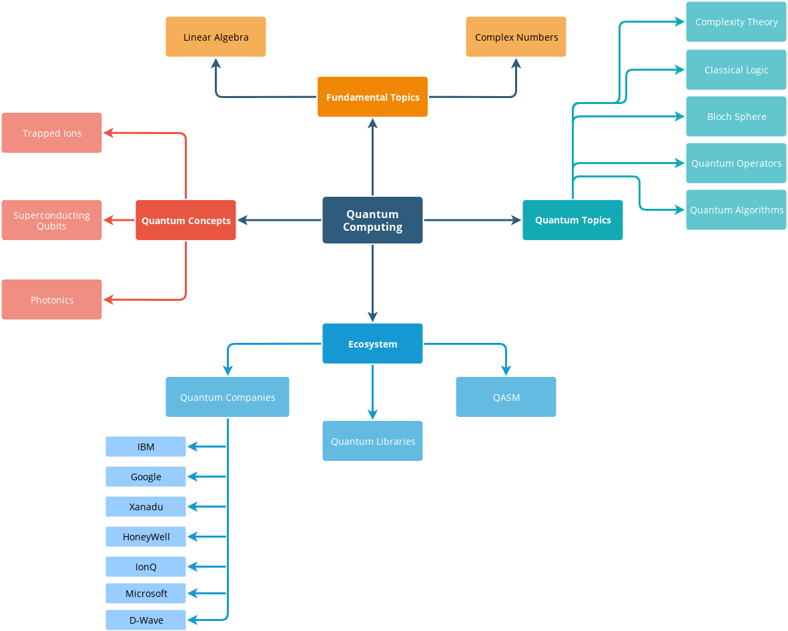
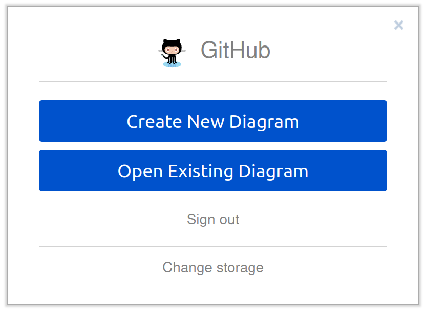

<!--
*** Thanks for checking the Quantum Computing Learning Stack repo.
*** If you have a suggestion that would make this better,
*** please fork the repo and create a pull request
*** or simply open an issue with the tag "improvement".
***
*** Don't forget to give the project a star ⭐️!
*** Thanks again! :D
-->

<!-- Project Shields -->

<!-- Project Links -->
[license-mit]: https://img.shields.io/github/license/dec0dOS/amazing-github-template.svg?style=flat-square

<!-- Project Logo -->
 

  

  <h3 align="center">Quantum Computing Learning Stack</h3>

  

    An awesome stack of Quantum Computing resources!
     
    <a href="https://github.com/pablomateo/quantum_computing_learning_stack"><strong>Explore the docs »</strong></a>
     
     
    <a href="https://github.com/pablomateo/quantum_computing_learning_stack">View Demo</a>
    ·
    <a href="https://github.com/pablomateo/quantum_computing_learning_stack/issues">Report Error</a>
    ·
    <a href="https://github.com/pablomateo/quantum_computing_learning_stack/issues">Request Feature</a>
  

<!-- Table of Contents -->

  
Table of Contents

  <ol>
    <li><a href="#getting-started">Getting Started</a></li>
    <li><a href="#resources">Resources</a>
    <ul>
      <li><a href="#fundamental-topics">Fundamental Topics</a></li>
      <ul>
        <li><a href="#linear-algebra-&-complex-numbers">Linear Algebra & Complex Numbers</a></li>
      </ul>
      <li><a href="#ecosystem">Ecosystem</a></li>
      <ul>
        <li><a href="#quantum-manufacturers">Quantum Manufacturers</a></li>
        <ul>
          <li><a href="#ibm">IBM</a></li>
          <li><a href="#google">Google</a></li>
        </ul>
      </ul>
      <li><a href="#blogs">Blogs</a></li>
      <li><a href="#books">Books</a></li>
      <li><a href="#popular-science">Popular Science</a></li>
      <li><a href="#Videos">videos</a></li>
      <li><a href="#Community">Community</a></li>
      <li><a href="#podcast">Podcast</a></li>
    </ul>
    </li>
    <li>
      <a href="#contributing">Contributing</a>
      <ul>
        <li><a href="#adding-information">Adding information</a></li>
        <li><a href="#improving-roadmap">Improving Roadmap</a></li>
        <li><a href="#generating-roadmap">Generating Roadmap</a></li>
      </ul>
    </li>
    <li><a href="#license">License</a></li>
    <li><a href="#acknowledgments">Acknowledgments</a></li>
  </ol>

<!-- GETTING STARTED -->
## Getting Started

This repo is meant to be a reference site of **Quantum Computing Learning** resources. We have a curated list of references, tutorials, books, videos and courses.

But we also want to reference all that information in a Quantum Learning Roadmap:

.

Read the <a href="#contributing">Contributing</a> section if you want to help build this community with us.
Thank you!

----

<!--
*** https://gist.github.com/rxaviers/7360908#file-gistfile1-md
*** Please reference the kind of resource with the following formats:
*** Book -> :blue_book:
*** Video -> :tv:
*** Course -> :school_satchel:
*** Link -> :link:
*** Thanks!
-->

# Resources

## Fundamental Topics
### Linear Algebra & Complex Numbers
- :blue_book:[The Mathematics of Quantum Mechanics][The Mathematics of Quantum Mechanics] - Martin Laforest PhD.
- :blue_book:[Linear Algebra by Jim Hefferon 4th Edition](https://joshua.smcvt.edu/linearalgebra/book.pdf)

<!---
## Quantum concepts
### Trapped ions
### Superconducting Qubits
### Photonics

## Quantum Topics
### Complexity Theory
### Classical Logic
### Block Sphere
### Quantum Operators
### Quantum Algorithms
--->

## Ecosystem
### Quantum Manufacturers
#### IBM
- :school_satchel:[Qiskit Textbook][Qiskit Textbook]
- :school_satchel:[IBM Q Full User Guide][IBM Q Full User Guide] - Short tutorials providing a gentle introduction to quantum computing and IBM Q.
- :link:[IBM Quantum Experience][IBM Quantum Experience] - IBM Quantum Experience
- :link:[Qiskit SDK][Qiskit SDK] - Software development kit by IBM for writing and running quantum algorithms on simulators and real hardware.

#### Google
- :school_satchel:[Google CirQ][Google CirQ]
- :link:[Cirq Library][Cirq Library] - Python library for writing, manipulating, and optimizing NISQ circuits to run on quantum computers.

<!---
#### Xanadu
#### HoneyWell
#### IonQ
--->

----
Pending to arrange

## Blogs

- [Decodoku](https://medium.com/@decodoku) - Interesting posts on quantum computation, by James Wootton.
- [Microsoft Quantum blog](https://cloudblogs.microsoft.com/quantum/) - Microsoft Quantum program-wide updates.

## Books

- [An Introduction to Quantum Computing](https://www.amazon.com/Introduction-Quantum-Computing-Phillip-Kaye/dp/019857049X/) - Strikes an excellent balance between accessiblity and mathematical rigour. It is suitable for undergraduate students.
- [Classical and Quantum Computation](https://books.google.com.au/books/about/Classical_and_Quantum_Computation.html?id=TrMposZZ0MQC&redir_esc=y) - Introduction to fundamentals of classical and quantum computing.
- [Dancing with Qubits](https://www.robertsutor.com/dancing-with-qubits/) - How quantum computing works and how it can change the world.
- [Learn Quantum Computation using Qiskit](http://community.qiskit.org/textbook) - An open-source textbook covering quantum algorithms and showing how to run them on real hardware using Qiskit. Also covers prerequisites.

## Popular Science

- [The Fabric of Reality: The Science of Parallel Universes and Its Implications](https://www.amazon.com/Fabric-Reality-Parallel-Universes-Implications/dp/014027541X) - It is of philosophical spirit, about revealing a unified fabric of reality explanation.

## Videos

- [Coding with Qiskit video series](https://www.youtube.com/playlist?list=PLOFEBzvs-Vvp2xg9-POLJhQwtVktlYGbY) - YouTube video series showing how to write quantum algorithms.
- [Quantum Computing for Computer Scientists](https://www.youtube.com/watch?v=F_Riqjdh2oM) - Microsoft Research Talk on introductory quantum computing for computer scientists. Duration: 1 hour, 28 minutes.

## Community

- [D-Wave Leap Community](https://support.dwavesys.com/hc/en-us/community/topics) - D-Wave System's Leap Community Forum.
- [IBM Q Community](https://community.qiskit.org/) - IBM Q Community page with list of upcoming events and latest programs.
- [IBM Q Qiskit Community](https://qiskit.slack.com/) - Slack Channel for Qiskit and quantum computing discussions.

## Podcasts

- [Meet the meQuanics](https://soundcloud.com/mequanics) - Interviews with key quantum computing figures, aimed at the lay person.
- [Quantum Computing Now](https://anchor.fm/quantumcomputingnow) - Podcast by Ethan Hansen covering three main topics: the basics of quantum computing, interviews and the latest news.

----

<!-- CONTRIBUTING -->
## Contributing

Contributions are what make the open source community such an amazing place to learn, inspire, and create. Any contributions you make are **greatly appreciated**.

You can contribute in two ways.
- Adding resources, links and information to the repo.
- Improving the **Quantum Learning Roadmap** -> `quantum_roadmap.drawio`.

<!-- Adding info -->
### Adding information
If you have a suggestion that would make this repo better, please fork it and create a **Pull Request**. You can also simply open an issue with the tag "improvement".

Don't forget to give the project a star!

1. Fork the Project
2. Create your Feature Branch (`git checkout -b feature/Resource`)
3. Commit your Changes (`git commit -m 'Add this resource'`)
4. Push to the Branch (`git push origin feature/Resource`)
5. Open a Pull Request

(<a href="#top">back to top</a>)

<!-- Improving Roadmap -->
### Improving Roadmap
If you want to improve the Quantum Learning Roadmap file, please follow these steps:

1. Fork the project
2. Go to [diagrams.net](https://www.diagrams.net/)
3. Choose to "Save diagrams to" GitHub

   - 

4. Choose "Open Existing Diagram"

   - 

5. Authorize the app through OAuth2 if asked

   - 

6. Choose the fork of this repository
7. Choose what branch the file you want to edit is on (the branch already needs to exist)
8. Choose the file you want to edit: `quantum_roadmap.draw.io`
   - 
9. You will now see the online editor; you can now edit your diagram as you like

   - 

10. When you make any changes; you will see a "Unsaved changes. Click here to save"-button.

   - 

11. Be careful to save it in draw.io xml format.
12. When you are ready to save your changes into a commit, click that button and write your commit message.
13. Create a Pull Request to our `main` branch.
14. Once approved, the GitHub Action detects the change, and automatically renders the "raw" `.drawio` file into the format of your liking.

<!-- Generating Roadmap -->
#### Generating Roadmap
Once a Pull Request is merged to `main` branch, a GitHub Action runs to generate the new roadmap files.
- **GitHub Action** -> Render Quantum Learning Stack -> `main.yml`
The workflow will create the `png` and `svg`versions.

Nevertheless, you can import the `quantum_roadmap.drawio` file directly to [diagrams.net](https://app.diagrams.net/) and export it the format you desire.

But please, share any changes with us!

<!-- LICENSE -->
## License
This project is licensed under the **MIT license**.    
See [LICENSE](LICENSE) for more information.

(<a href="#top">back to top</a>)

<!-- ACKNOWLEDGMENTS -->
## Acknowledgments

<!-- Links -->
[The Mathematics of Quantum Mechanics]:https://uwaterloo.ca/institute-for-quantum-computing/sites/ca.institute-for-quantum-computing/files/uploads/files/mathematics_qm_v21.pdf
[Qiskit Textbook]:https://qiskit.org/textbook/preface.html
[Google CirQ]:https://quantumai.google/cirq
[IBM Q Full User Guide]:https://quantumexperience.ng.bluemix.net/qx/tutorial?sectionId=full-user-guide&page=introduction
[Cirq Library]:https://github.com/quantumlib/Cirq
[IBM Quantum Experience]:https://quantum-computing.ibm.com
[Qiskit SDK]:https://qiskit.org
